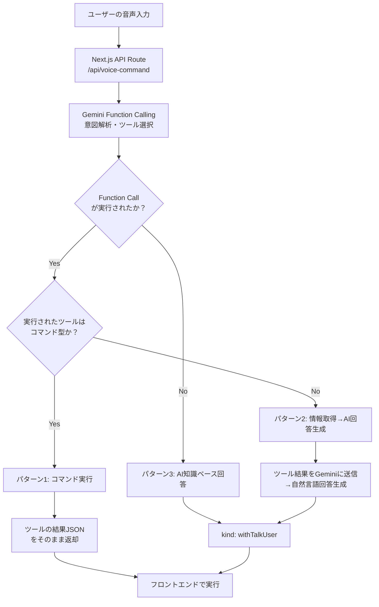

# AI クッキングアシスタント - Gemini Function Calling による 3 パターン処理

## システム概要

本システムは、Google Gemini の Function Calling 機能を使用して、ユーザーの音声入力を 3 つのパターンに自動分類し、適切な応答を返すAIクッキングアシスタントです。

### 全体アーキテクチャ図



### 3 パターンの処理方式

Gemini の Function Calling 機能により、以下の 3 パターンが自動判定・実行されます：

1. **パターン 1: コマンド型ツール実行**
   - **判断基準**: Gemini が Function Call を実行 かつ `isCommandTool(functionName) === true`
   - **対象ツール**: `method_video`, `video_control`, `timer_control`
   - **処理**: Function の実行結果 JSON をそのまま API レスポンスとして返却
   - **目的**: フロントエンドでの即座実行（動画制御、タイマー操作など）

2. **パターン 2: 情報取得型ツール + AI 回答生成**
   - **判断基準**: Gemini が Function Call を実行 かつ `isCommandTool(functionName) === false`
   - **対象ツール**: `recipe_search`
   - **処理**: ツール実行結果を Gemini に送信 → AI が自然言語で詳細回答を生成
   - **目的**: 取得した情報を基に親しみやすい口調で詳細説明

3. **パターン 3: AI 知識ベース回答**
   - **判断基準**: Gemini が Function Call を実行しない
   - **対象**: ツールが不要な一般的な料理質問
   - **処理**: Gemini の知識のみで直接回答を生成
   - **目的**: 一般的な料理知識やアドバイスの提供

### 実装での判定ロジック（Gemini Function Calling）

```typescript
// 1. Gemini Function Calling 実行
const result = await chat.sendMessage(transcript);
const response = result.response;
const functionCalls = response.functionCalls();

// 2. Function Call 使用チェック
if (functionCalls && functionCalls.length > 0) {
  const functionCall = functionCalls[0];
  const functionName = functionCall.name;
  const functionArgs = functionCall.args;

  // 3. コマンド型ツール判定
  if (this.isCommandTool(functionName)) {
    // パターン1: Function実行結果JSONをそのまま返す
    const toolResult = await this.executeFunction(functionName, functionArgs, recipeId);
    return { pattern: 1, response: JSON.parse(toolResult) };
  } else {
    // パターン2: ツール実行→Geminiが回答生成
    const toolResult = await this.executeFunction(functionName, functionArgs, recipeId);
    
    // ツール結果をGeminiに送信してAI回答生成
    const followUpResult = await chat.sendMessage([{
      functionResponse: { name: functionName, response: { result: toolResult } }
    }]);
    
    return {
      pattern: 2,
      response: { kind: "withTalkUser", payload: { talkMessage: followUpResult.response.text() } }
    };
  }
} else {
  // パターン3: Function Call未使用→AIの知識ベース回答
  return {
    pattern: 3,
    response: { kind: "withTalkUser", payload: { talkMessage: response.text() } }
  };
}
```

## 1. レシピ詳細取得（パターン 2: 情報取得型）

### フロー図（レシピ詳細取得）

```text
ユーザー音声入力
「このレシピの詳細を教えて」
         ↓
   Gemini Function Calling
   (意図解釈 + Function選択)
         ↓
  recipe_search Function実行
  (情報取得型ツール)
         ↓
  Rails API からレシピ詳細取得
  GET /recipes/{recipe_id}
         ↓
    レシピ詳細データ取得
    (材料、手順、コツ、評価など)
         ↓
   Gemini AI 回答生成
  (取得データを基に親しみやすい回答)
         ↓
    API レスポンス（JSON）
{
  "kind": "withTalkUser",
  "payload": {
    "talkMessage": "基本のバターカレーの作り方をご紹介しますね♪

    【材料】
    ・牛バラ肉: 300g
    ・玉ねぎ: 2個
    ・カレールー: 4皿分
    ・牛乳: 200ml

    【手順】
    1. 玉ねぎを薄切りにして炒める
    2. 牛バラ肉を加えて炒める
    3. 水を加えて15分煮込む
    4. カレールーと牛乳を加えて仕上げる

    【コツ】
    玉ねぎはしっかり炒めることで甘みが増します♪

    調理時間: 30分
    きっと美味しくできますよ！"
  }
}
         ↓
      フロントエンド
  ・AI回答をチャットUIに表示
  ・音声で親しみやすい説明を読み上げ
```

### コード実装（レシピ詳細取得）

```typescript
// web/src/lib/tools.ts - Gemini Function用のツール定義
export function createRecipeSearchTool() {
  return new DynamicStructuredTool({
    name: "recipe_search",
    description: "ユーザーが指定したレシピIDでレシピの詳細情報を取得する。材料、手順、コツなどの完全な情報を提供します。",
    schema: z.object({
      recipe_id: z.string().describe("ユーザーが指定したレシピのID"),
    }),
    func: async ({ recipe_id }) => {
      console.log(`🍳 [Tool] レシピ詳細取得: ${recipe_id}`);

      try {
        // Rails API からレシピ詳細を取得
        const response = await fetch(`http://localhost:3001/recipes/${recipe_id}`, {
          method: "GET",
          headers: { "Content-Type": "application/json" },
        });

        if (!response.ok) throw new Error(`API Error: ${response.status}`);
        
        const recipe = await response.json();
        const attrs = recipe.attributes || recipe;

        // レシピ詳細情報を整形してGeminiに返す
        const formattedResult = `🍳 ${attrs.title}

📊 基本情報:
⏱️ 調理時間: ${attrs.cooking_time}分
💰 推定費用: ${attrs.estimated_cost}円
⭐ 評価: ${attrs.review_score ? `${attrs.review_score}/5.0` : "未評価"}
🏷️ カテゴリ: ${Array.isArray(attrs.category) ? attrs.category.join(", ") : attrs.category}

📝 説明: ${attrs.description || "レシピの詳細説明"}

🥄 材料: ${attrs.ingredients && Array.isArray(attrs.ingredients) 
  ? attrs.ingredients.map(ing => `• ${ing.name || ing}: ${ing.amount || ""}`).join("\n")
  : "材料リストが利用できません"}

👨‍🍳 作り方: ${attrs.instructions && Array.isArray(attrs.instructions)
  ? attrs.instructions.map((step, i) => `${i + 1}. ${step.description || step}`).join("\n")
  : "調理手順が利用できません"}

💡 コツ・ポイント: ${attrs.tips || "美味しく作るためのコツをお聞かせください！"}`;

        return formattedResult;
      } catch (error) {
        return `レシピ取得エラー: 申し訳ありません。現在レシピデータベースにアクセスできません。`;
      }
    },
  });
}

// web/src/app/api/voice-command/route.ts - Next.js API Route
export async function POST(req: NextRequest) {
  const { searchParams } = new URL(req.url);
  const recipeId = searchParams.get("recipe_id");
  const { speechText } = await req.json();

  // Gemini Function Callingで3パターンを自動判定・処理
  const agentResult = await GeminiAIService.processWithLangChainAgent(speechText, recipeId);

  return NextResponse.json(agentResult.response);
}
```

---

## 2. 調理法動画制御（method_video）- コマンド実行パターン

### フロー図（動画検索）

```text
ユーザー音声入力
「ハンバーグの動画を見せて」
         ↓
    OpenAI LLM
    (意図解釈)
         ↓
  video_searchツール選択・実行
         ↓
    API レスポンス（JSON）
{
  "type": "video_search",
  "payload": {
    "query": "ハンバーグ"
  }
}
         ↓
      フロントエンド
  ・動画検索API呼び出し
  ・動画プレーヤーUI表示
  ・「ハンバーグの動画を表示します」音声出力
```

### コード実装（動画検索）

```typescript
// コマンド型ツール（パターン1）- JSONをそのまま返す
const videoSearchTool = new DynamicStructuredTool({
  name: "video_search",
  description: "料理動画を検索する。料理名や調理法で動画を見つけることができます。",
  schema: z.object({
    query: z.string().describe("検索する動画のキーワード（料理名など）"),
  }),
  func: async ({ query }) => {
    console.log(`🎬 [Tool] 動画検索実行: ${query}`);

    // フロントエンド向けのコマンドJSONを返す
    return JSON.stringify({
      type: "video_search",
      payload: { query },
    });
  },
});

// AIServiceでの判定
private static isCommandTool(toolName: string): boolean {
  return ["video_search", "video_control", "timer_control"].includes(toolName);
}

// パターン1の処理: ツールJSONをそのまま返す
if (this.isCommandTool(toolName)) {
  return {
    pattern: 1,
    response: JSON.parse(toolOutput), // {"type": "video_search", "payload": {"query": "ハンバーグ"}}
  };
}
```

---

## 3. 動画操作（video_control）- リアルタイム制御パターン

### フロー図（動画操作）

```text
ユーザー音声入力
「動画を30秒戻して」
         ↓
    OpenAI LLM
    (意図解釈 + パラメータ抽出)
         ↓
  video_controlツール選択・実行
  action: "seek_backward"
  seconds: 30
         ↓
    API レスポンス（JSON）
{
  "type": "video_control",
  "payload": {
    "action": "seek_backward",
    "seconds": 30
  }
}
         ↓
      フロントエンド
  ・videoPlayer.seekBackward(30)実行
  ・「30秒巻き戻しました」音声出力
```

### コード実装（動画操作）

```typescript
const videoControlTool = new DynamicStructuredTool({
  schema: z.object({
    action: z.enum([
      "play",
      "pause",
      "seek_forward",
      "seek_backward",
      "restart",
    ]),
    seconds: z.number().optional(),
  }),
  func: async ({ action, seconds }) => {
    // フロントエンドが実行できる制御指示を返す
    return JSON.stringify({
      type: "video_control",
      payload: { action, seconds },
    });
  },
});
```

---

## 4. タイマー操作（timer_control）- 自然言語解析 → 数値変換パターン

### フロー図（タイマー操作）

```text
ユーザー音声入力
「5分のタイマーをセットして」
         ↓
    OpenAI LLM
    (意図解釈 + 時間表現認識)
         ↓
  timer_controlツール選択・実行
  action: "start"
  duration: "5分"
         ↓
  ツール内で自然言語処理
  parseTimeToSeconds("5分") → 300秒
         ↓
    API レスポンス（JSON）
{
  "type": "timer_control",
  "payload": {
    "action": "start",
    "seconds": 300
  }
}
         ↓
      フロントエンド
  ・timer.start(300)実行
  ・タイマーUI表示（5:00）
  ・「5分のタイマーを開始しました」音声出力
```

### コード実装（タイマー操作）

```typescript
const timerControlTool = new DynamicStructuredTool({
  schema: z.object({
    action: z.enum(["start", "stop", "check", "add_time"]),
    duration: z.string().optional(), // 自然言語の時間表現
  }),
  func: async ({ action, duration }) => {
    // 自然言語 → 数値変換（バックエンドで処理）
    const seconds = duration ? parseTimeToSeconds(duration) : undefined;

    return JSON.stringify({
      type: "timer_control",
      payload: { action, seconds }, // 変換済みの数値をフロントに渡す
    });
  },
});

function parseTimeToSeconds(timeStr: string): number {
  let totalSeconds = 0;
  const hourMatch = timeStr.match(/(\d+)\s*時間/);
  const minuteMatch = timeStr.match(/(\d+)\s*分/);
  const secondMatch = timeStr.match(/(\d+)\s*秒/);

  if (hourMatch) totalSeconds += parseInt(hourMatch[1]) * 3600;
  if (minuteMatch) totalSeconds += parseInt(minuteMatch[1]) * 60;
  if (secondMatch) totalSeconds += parseInt(secondMatch[1]);

  return totalSeconds;
}
```

---

## 5. フォールバック（generate_text_response）- 直接回答パターン

### フロー図（フォールバック）

```text
ユーザー音声入力
「玉ねぎはどのくらい炒めればいい？」
         ↓
    OpenAI LLM
    (意図解釈)
         ↓
   「ツール不要」と判断
   知識ベースから直接回答
         ↓
    API レスポンス（JSON）
{
  "type": "generate_text_response",
  "payload": {
    "message": "玉ねぎは透明になるまで中火で5-7分ほど炒めると甘みが出て美味しくなりますよ。焦げないように時々かき混ぜてくださいね。"
  }
}
         ↓
      フロントエンド
  ・チャットUIにメッセージ表示
  ・音声でメッセージを読み上げ
```

### コード実装（フォールバック）

```typescript
// AIクッキングアシスタントクラス
export class AICookingAssistant {
  async processUserInput(userInput: string): Promise<any> {
    const result = await this.agent.invoke({ input: userInput });

    // ツール実行結果があればそれを返す
    if (result.intermediateSteps?.length > 0) {
      const toolResult = result.intermediateSteps[0].observation;
      return { toolCalls: [toolResult] };
    }

    // フォールバック: 直接回答
    return {
      response: result.output,
      toolCalls: [],
    };
  }
}

// APIエンドポイント
app.post("/api/voice-command", async (req, res) => {
  const { speechText } = req.body;

  try {
    const result = await assistant.processUserInput(speechText);

    if (result.toolCalls?.length > 0) {
      // ツール実行結果をパースして返却
      const toolResult = JSON.parse(result.toolCalls[0]);
      res.json(toolResult);
    } else {
      // フォールバック応答
      res.json({
        type: "generate_text_response",
        payload: {
          message: result.response,
        },
      });
    }
  } catch (error) {
    res.status(500).json({
      type: "generate_text_response",
      payload: {
        message: "申し訳ありません。もう一度お話しください。",
      },
    });
  }
});
```

---

## フロントエンドでの統一処理

```typescript
class VoiceCommandHandler {
  async handleUserSpeech(speechText: string) {
    try {
      const response = await fetch("/api/voice-command", {
        method: "POST",
        headers: { "Content-Type": "application/json" },
        body: JSON.stringify({ speechText }),
      });

      const command = await response.json();

      // コマンドタイプ別の処理実行
      await this.executeCommand(command);
    } catch (error) {
      this.speakResponse("エラーが発生しました");
    }
  }

  private async executeCommand(command: any) {
    switch (command.type) {
      case "recipe_search":
        this.showRecipeList(command.payload.recipes);
        this.speakResponse(`${command.payload.query}のレシピを表示しました`);
        break;

      case "video_search":
        await this.searchAndShowVideo(command.payload.query);
        this.speakResponse(`${command.payload.query}の動画を表示します`);
        break;

      case "video_control":
        this.controlVideoPlayer(
          command.payload.action,
          command.payload.seconds
        );
        this.speakResponse(this.getControlMessage(command.payload));
        break;

      case "timer_control":
        this.controlTimer(command.payload.action, command.payload.seconds);
        this.speakResponse(this.getTimerMessage(command.payload));
        break;

      case "generate_text_response":
        this.showChatMessage(command.payload.message);
        this.speakResponse(command.payload.message);
        break;
    }
  }
}
```

---

## パターン別の特徴まとめ

| パターン               | Gemini 処理                    | API 応答形式           | フロントエンド処理          |
| ---------------------- | ------------------------------ | ---------------------- | --------------------------- |
| **レシピ詳細取得**     | Rails API 連携 + AI 回答生成  | `withTalkUser`         | チャット表示 + 音声読み上げ |
| **調理法動画**         | パラメータ抽出のみ             | `methodToVideo`        | 動画制御 + UI 表示          |
| **動画操作**           | パラメータ抽出                 | `videoControll`        | プレーヤー操作 + 音声確認   |
| **タイマー**           | 自然言語 → 数値変換            | `timer`                | タイマー操作 + UI 更新      |
| **AI 知識ベース回答**  | Gemini 知識のみで直接回答      | `withTalkUser`         | チャット表示 + 音声読み上げ |

## 技術スタック

- **AI エンジン**: Google Gemini 1.5 Pro (Function Calling)
- **バックエンド**: Next.js API Routes + Rails API
- **フロントエンド**: Next.js (React)
- **データベース**: MySQL (Rails)
- **レスポンス形式**: 統一 JSON (`kind` + `payload`)

**アーキテクチャの特徴**: Gemini Function Calling による自動意図判定と、適切なツール選択・実行により、高精度で自然な音声アシスタント体験を実現しています。
