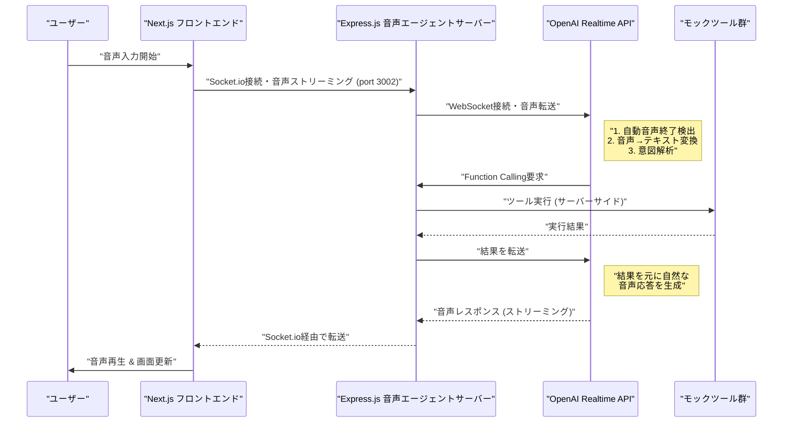

## 🎤 音声エージェント機能

このプロジェクトには **Express.js** + **OpenAI Realtime API** を使った音声アシスタント機能が実装されています。

### 🌟 主な機能

- **音声でのレシピ検索**: 「カレーの作り方を教えて」
- **動画表示操作**: 「動画を見せて」「一時停止して」
- **タイマー設定**: 「5 分のタイマーをセットして」
- **リアルタイム音声対話**: 低遅延での自然な会話

### 🛠️ 技術構成

#### アーキテクチャ概要



#### Express.js 音声エージェントサーバーの役割

**Express.js + Socket.io 専用サーバー**が以下を実現：

```
┌─────────────────────────────────────────────────────────┐
│            Express.js 音声エージェントサーバー (port 3002)    │
├─────────────────────────────────────────────────────────┤
│                                                         │
│  ┌─────────────────┐    ┌─────────────────────────────┐ │
│  │   Express App   │    │     Socket.io Server        │ │
│  │                 │    │                             │ │
│  │  - HTTP API     │    │  - WebSocket管理            │ │
│  │  - ヘルスチェック  │    │  - OpenAI Realtime接続     │ │
│  │  - CORS設定     │    │  - Function Calling実行    │ │
│  └─────────────────┘    └─────────────────────────────┘ │
│                                                         │
└─────────────────────────────────────────────────────────┘

  ┌─────────────────────────────────────────────────────────┐
  │              Next.js フロントエンド (port 3000)             │
  │                                                         │
  │  - React Components                                     │
  │  - Socket.io Client                                     │
  │  - UI/UX                                                │
  └─────────────────────────────────────────────────────────┘
```

### 📁 ファイル構成

音声エージェント機能の実装に関わる主要ファイル：

```
voice-agent-server/              # Express.js 音声エージェント専用サーバー
├── server.js                    # Express + Socket.io + CORS設定 (143行)
├── src/
│   ├── realtime-proxy.js       # OpenAI Realtime API プロキシ (259行)
│   └── tools-service.js        # モックツール実装 (85行)
├── package.json                # 依存関係: express, socket.io, ws, cors, dotenv
├── README.md                   # 詳細セットアップ手順
└── .env                        # 環境変数 (OPENAI_API_KEY等)

web/                            # Next.js フロントエンド
├── src/
│   ├── components/
│   │   └── VoiceInterface.tsx  # 音声インターフェースUI (321行)
│   └── app/
│       ├── page.tsx            # メインページ統合 (85行)
│       └── layout.tsx          # レイアウト設定
└── package.json               # 依存関係: socket.io-client
```

### ⚙️ 音声エージェントのセットアップ

#### 1. OpenAI API キーの取得

1. **OpenAI Platform**にアクセス: https://platform.openai.com/
2. ログイン後、左メニューから**API Keys**を選択
3. **Create new secret key**をクリック
4. 生成された API キーをコピー

#### 2. Express.js 音声エージェントサーバーの起動

```bash
# 1. サーバーディレクトリに移動
cd voice-agent-server

# 2. 依存関係インストール
npm install

# 3. 環境変数設定（実際のAPIキーに置き換え）
echo "OPENAI_API_KEY=sk-your-actual-api-key-here" > .env

# 4. サーバー起動 (port 3002)
npm run dev

# 5. 起動確認ログ
# 🚀 Voice Agent Server running on http://localhost:3002
# 📡 Socket.io server ready
# 🤖 OpenAI API configured: true
# 🔒 CORS allowed origins: [ 'http://localhost:3000', ... ]
```

#### 3. Next.js フロントエンドの起動

```bash
# 1. webディレクトリに移動
cd web

# 2. 依存関係インストール（socket.io-clientを含む）
npm install

# 3. フロントエンド起動 (port 3000)
npm run dev

# 4. ブラウザでアクセス
# http://localhost:3000
```

#### 4. 使用方法

1. **Express.js 音声エージェントサーバー起動** (localhost:3002)
2. **Next.js フロントエンド起動** (localhost:3000)
3. **ブラウザでアクセス** → http://localhost:3000
4. **「接続する」ボタン**をクリック
5. **「話しかける」ボタン**を押して音声入力開始

#### 5. 動作確認方法

```bash
# サーバーヘルスチェック
curl http://localhost:3002/health

# 期待されるレスポンス
{
  "status": "healthy",
  "timestamp": "2025-01-14T...",
  "openai_configured": true
}
```

#### 6. 利用可能なコマンド例（モック応答）

- 🍳 **レシピ検索**: 「カレーライスの作り方を教えて」
- 🎥 **動画操作**: 「ハンバーグの動画を見せて」「動画を一時停止して」
- ⏰ **タイマー**: 「3 分のタイマーをセットして」「5 分 30 秒でタイマーお願いします」

**注意**: 現在のツール実装はすべてモック応答です。実際の機能実装は後で追加予定。

### 🔧 開発者向け情報

#### 🏗️ アーキテクチャ詳細

**Express.js サーバー構成**:

- **server.js**: Express + Socket.io 統合、CORS 設定、環境別オリジン管理
- **realtime-proxy.js**: OpenAI Realtime API 接続、メッセージ処理、Function Calling 実行
- **tools-service.js**: シンプルなモック応答のみ

**重要な実装ポイント**:

1. **プロキシパターン**: ブラウザ ↔ Express ↔ OpenAI API の 3 層構造
2. **セキュリティ**: API キーはサーバーサイドで管理、CORS 制限あり
3. **リアルタイム通信**: Socket.io（クライアント-サーバー）+ WebSocket（サーバー-OpenAI）

#### 🎤 音声処理の詳細実装

**現在の音声処理フロー**:

```javascript
// 1. ユーザーマイク音声の取得 (24kHz, モノラル)
navigator.mediaDevices.getUserMedia({
  audio: {
    sampleRate: 24000,    // OpenAI Realtime API要件
    channelCount: 1,      // モノラル
  },
})

// 2. AudioContextによるリアルタイム音声処理
AudioContext (24kHz) → ScriptProcessor (4096バッファ) → PCM16変換

// 3. Float32 → Int16 (PCM16) 変換
for (let i = 0; i < inputData.length; i++) {
  const sample = Math.max(-1, Math.min(1, inputData[i]));
  pcm16Data[i] = sample < 0 ? sample * 0x8000 : sample * 0x7fff;
}

// 4. Base64エンコード → OpenAI Realtime API送信
Uint8Array(pcm16Data.buffer) → Base64 → Socket.io → Express → OpenAI
```

**音声フォーマット要件**:

- **サンプリングレート**: 24kHz (OpenAI Realtime API 必須)
- **チャンネル数**: 1 (モノラル)
- **ビット深度**: 16bit PCM
- **エンコーディング**: Base64 エンコードされたバイナリ
- **転送方式**: リアルタイムストリーミング (100ms 間隔)

**音声処理の実装課題と解決策**:

1. **WebM → PCM16 変換**:

   - **課題**: MediaRecorder の WebM 出力は OpenAI API と非互換
   - **解決**: AudioContext + ScriptProcessor で直接 PCM16 生成

2. **リアルタイム性能**:

   - **バッファサイズ**: 4096 サンプル (約 170ms@24kHz)
   - **転送間隔**: 100ms 毎でデータ送信
   - **遅延最小化**: ストリーミング処理

3. **リソース管理**:
   - **メモリリーク防止**: AudioStream、Processor 適切に切断
   - **マイク権限**: 録音停止時にトラック解放

#### 🔧 モックツール実装

現在の`tools-service.js`は全ツールに対して統一レスポンス：

```javascript
static async executeFunction(name, args) {
  console.log(`[ToolsService] Mock executing: ${name}`, args);

  return {
    success: true,
    message: `${name} を実行しました（モック応答）`,
    data: {
      tool: name,
      args: args,
      timestamp: new Date().toISOString(),
      note: "これはモック応答です。実際の実装は後で追加予定。"
    }
  };
}
```

#### 🛠️ 新しいツールの追加

1. `getToolDefinitions()`に新しいツール定義を追加
2. 現在は`executeFunction()`でモック応答、将来は個別実装を追加

#### 🔗 Socket.io 接続の詳細

フロントエンドは Express.js サーバーに直接接続：

```javascript
import { io } from "socket.io-client";
const socket = io("http://localhost:3002");
```

**主要な Socket.io イベント**:

- `connect` / `disconnect`: 接続状態管理
- `audio_data`: 音声データストリーミング
- `transcription`: 音声認識結果受信
- `audio_response`: AI 音声レスポンス受信
- `tool_result`: Function Calling 結果受信

#### 🔄 Express.js プロキシサーバーの処理フロー

**リアルタイム音声処理の詳細**:

```javascript
// 1. フロントエンドからの音声データ受信
socket.on('audio_data', (data) => {
  // OpenAI Realtime APIに転送
  openaiWebSocket.send(JSON.stringify({
    type: 'input_audio_buffer.append',
    audio: data.audio // Base64 PCM16データ
  }));
});

// 2. OpenAI APIからの応答処理
openaiWebSocket.on('message', (message) => {
  const response = JSON.parse(message);

  switch(response.type) {
    case 'response.audio.delta':
      // 音声ストリーミング応答をフロントエンドに転送
      socket.emit('audio_response', response);
      break;

    case 'response.function_call_arguments.done':
      // Function Calling実行
      const result = await ToolsService.executeFunction(
        response.name,
        JSON.parse(response.arguments)
      );

      // 結果をOpenAI APIに返送
      openaiWebSocket.send(JSON.stringify({
        type: 'conversation.item.create',
        item: { type: 'function_call_output', output: JSON.stringify(result) }
      }));
      break;
  }
});
```

**プロキシサーバーの役割**:

1. **セキュリティ**: OpenAI API キーをサーバーサイドで管理
2. **Function Calling**: サーバーサイドでツール実行
3. **データ変換**: フロントエンド ↔ OpenAI API 間のメッセージ変換
4. **エラーハンドリング**: 接続エラー、API エラーの適切な処理

#### 🔧 CORS 設定

**動的オリジン管理**:

```javascript
const getAllowedOrigins = () => {
  const baseOrigins = [
    "http://localhost:3000", // Next.js
    "http://localhost:3001", // Rails
    "http://127.0.0.1:3000", // IPアドレス版
    "http://127.0.0.1:3001",
  ];

  // 本番環境では環境変数から追加
  if (process.env.NODE_ENV === "production") {
    const prodOrigins = process.env.ALLOWED_ORIGINS?.split(",") || [];
    return [...baseOrigins, ...prodOrigins];
  }

  return baseOrigins;
};
```

### 🚨 制限事項・注意点

#### 📊 現在の実装状況

**✅ 完全実装済み**:

- **Express.js サーバー**: CORS 設定、環境別オリジン管理
- **Socket.io 統合**: WebSocket + HTTP サーバー統合
- **OpenAI Realtime API**: プロキシ、メッセージ処理、エラーハンドリング
- **音声インターフェース**: React UI、音声録音・再生、Socket.io 接続

**⚠️ モック実装**:

- **Function Calling**: 4 つのツール定義済み、実行はモック応答のみ
- **ツール機能**: レシピ検索、動画操作、タイマーは全てモック

**🔄 準備済み（実装待ち）**:

- **Rails API 連携**: 環境変数設定済み、実際の接続は未実装

#### 🚫 技術的制約

1. **OpenAI Realtime API**: 最新安定版使用（`gpt-4o-realtime`）
2. **音声権限**: ユーザーのマイクアクセス許可が必要
3. **ブラウザ対応**: WebRTC/MediaRecorder API 必須
4. **ネットワーク**: WebSocket 接続必須
5. **セキュリティ**: API キーはサーバーサイドのみ、CORS 制限あり

### 🛠️ トラブルシューティング

#### よくある問題

**Q: 音声インターフェースで「接続する」ボタンを押してもエラーが出る**

```bash
# A: Express.jsサーバーが起動しているか確認
cd voice-agent-server
npm run dev
```

**Q: OpenAI API 接続エラー**

```bash
# A: 環境変数の確認
echo $OPENAI_API_KEY
# または.envファイルの確認
cat voice-agent-server/.env
```

**Q: 音声録音が開始されない**

- ブラウザのマイクアクセス許可を確認
- HTTPS または localhost でアクセスしているか確認
- コンソールエラーを確認

#### デバッグ方法

1. **サーバーログ確認**: Express.js サーバーのコンソール出力
2. **ブラウザコンソール**: フロントエンドのエラー確認
3. **ネットワークタブ**: WebSocket 接続状態確認
4. **ヘルスチェック**: http://localhost:3002/health でサーバー状態確認

### 🚀 今後の開発ロードマップ

#### 📅 短期目標（次の実装ステップ）

- [ ] **ツール実装**: モック応答から実際の機能実装に変更
- [ ] **Rails API 連携**: レシピデータベース検索の実装
- [ ] **動画機能**: 実際の動画表示・操作機能
- [ ] **タイマー機能**: ブラウザ内タイマーの実装
- [ ] **エラーハンドリング**: 詳細なエラー処理とユーザー通知

#### 📅 中期目標（機能拡張）

- [ ] **音声品質向上**: ノイズキャンセル、音声最適化
- [ ] **レスポンス最適化**: キャッシュ、接続プール
- [ ] **認証機能**: ユーザー管理、セッション管理
- [ ] **ログ機能**: 詳細な使用状況追跡
- [ ] **テスト**: 単体・統合テストの追加

#### 📅 長期目標（高度な機能）

- [ ] **多言語対応**: 英語・韓国語等の追加
- [ ] **パーソナライゼーション**: ユーザー好み学習
- [ ] **音声感情認識**: 感情に応じた応答調整
- [ ] **マルチモーダル**: 画像認識との統合
- [ ] **スケーラビリティ**: 大規模運用対応

#### 🔧 現在の実装完成度

```
基盤アーキテクチャ    ████████████ 100%
音声入出力           ████████████ 100% (PCM16フォーマット対応済み)
リアルタイム通信      ████████████ 100%
OpenAI API統合       ████████████ 100%
Function Calling     ████████░░░░  75% (定義済み、実装はモック)
UI/UX               ████████████ 100%
Rails連携           ████░░░░░░░░  25% (準備済み)
エラー処理          ████████░░░░  80%
セキュリティ        ████████████ 100%
ドキュメント        ████████████ 100%
```

**🎤 音声処理の技術詳細**:

- ✅ **WebM → PCM16 変換**: MediaRecorder 廃止、AudioContext 採用
- ✅ **24kHz モノラル**: OpenAI Realtime API 完全対応
- ✅ **リアルタイムストリーミング**: 4096 サンプル/170ms バッファ
- ✅ **Base64 エンコーディング**: Int16 → Uint8Array → Base64
- ✅ **リソース管理**: AudioStream、Processor 適切な切断処理
