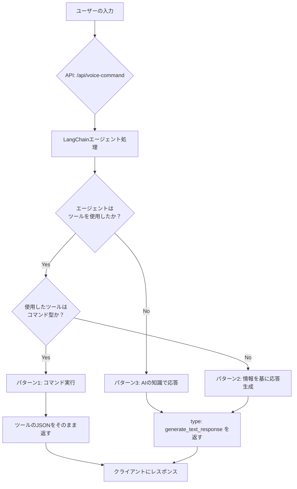

# AI クッキングアシスタント - LangChain エージェントによる 3 パターン処理（API 版）

## LangChain エージェントによる 3 パターン処理

### 全体フロー図



### 3 パターンの対応方針

LangChain エージェントが実行した結果を基に、以下の判定フローで 3 パターンを自動分類します：

1. **パターン 1: コマンド型ツール実行**

   - **判断基準**: `result.intermediateSteps.length > 0` かつ `isCommandTool(toolName) === true`
   - **対象ツール**: `video_search`, `video_control`, `timer_control`
   - **処理**: ツールが返した JSON（`toolCall.observation`）をそのまま API レスポンスとして返す
   - **目的**: フロントエンドで即座に実行可能な操作指示を送信

2. **パターン 2: 情報取得型ツール + AI 回答生成**

   - **判断基準**: `result.intermediateSteps.length > 0` かつ `isCommandTool(toolName) === false`
   - **対象ツール**: `recipe_search`
   - **処理**: LangChain エージェントの最終出力（`result.output`）を`generate_text_response`形式で返す
   - **目的**: ツールで取得した情報を基に AI が自然言語で詳細回答を生成

3. **パターン 3: AI 知識ベース回答**
   - **判断基準**: `result.intermediateSteps.length === 0`
   - **対象**: ツールが不要な一般的な質問
   - **処理**: LangChain エージェントの最終出力（`result.output`）を`generate_text_response`形式で返す
   - **目的**: AI の知識のみで直接回答を生成

### 実装での判定ロジック

```typescript
// 1. エージェント実行
const result = await agentExecutor.invoke({ input: transcript });

// 2. ツール使用チェック
if (result.intermediateSteps && result.intermediateSteps.length > 0) {
  const toolName = result.intermediateSteps[0].action.tool;
  const toolOutput = result.intermediateSteps[0].observation;

  // 3. コマンド型ツール判定
  if (this.isCommandTool(toolName)) {
    // パターン1: ツールJSONをそのまま返す
    return { pattern: 1, response: JSON.parse(toolOutput) };
  } else {
    // パターン2: AIが生成した回答を返す
    return {
      pattern: 2,
      response: {
        type: "generate_text_response",
        payload: { message: result.output },
      },
    };
  }
} else {
  // パターン3: AIの知識ベース回答
  return {
    pattern: 3,
    response: {
      type: "generate_text_response",
      payload: { message: result.output },
    },
  };
}
```

## 1. レシピ検索（パターン 2: 情報提供型）

### フロー図（レシピ検索）

```text
ユーザー音声入力
「カレーの作り方を教えて」
         ↓
   LangChainエージェント
   (意図解釈 + ツール選択)
         ↓
  recipe_searchツール実行
  (情報取得型ツール)
         ↓
  ツール内でDB検索実行
  searchRecipeDatabase("カレー")
         ↓
    検索結果を取得
    [レシピオブジェクト配列]
         ↓
   LangChainエージェント
  (検索結果を基に自然な回答生成)
         ↓
    API レスポンス（JSON）
{
  "type": "generate_text_response",
  "payload": {
    "message": "基本のビーフカレーの作り方をご紹介しますね！

    【材料】
    ・牛肉 400g
    ・玉ねぎ 2個
    ・じゃがいも 3個
    ・人参 1本
    ・カレールー 1箱

    【手順】
    1. 野菜を一口大に切る
    2. 牛肉を炒める
    3. 野菜を加えて炒める
    4. 水を加えて煮込む（60分）
    5. カレールーを加えて仕上げる

    【コツ】
    玉ねぎをしっかり炒めると甘みが出て美味しくなりますよ！"
  }
}
         ↓
      フロントエンド
  ・生成された回答をチャットUIに表示
  ・音声で詳細なレシピ説明を読み上げ
```

### コード実装（レシピ検索）

```typescript
// LangChain DynamicStructuredTool でレシピ検索ツールを定義
const recipeSearchTool = new DynamicStructuredTool({
  name: "recipe_search",
  description:
    "レシピを検索して詳細な情報を取得する。料理名や食材名で検索できます。",
  schema: z.object({
    query: z.string().describe("検索する料理名や食材名"),
  }),
  func: async ({ query }) => {
    console.log(`🍳 [Tool] レシピ検索実行: ${query}`);

    // 実際のDB検索やAPI呼び出し
    const mockRecipes = [
      {
        id: 1,
        title: `基本の${query}`,
        ingredients: [
          { name: "主材料A", amount: "300g" },
          { name: "主材料B", amount: "2個" },
          { name: "調味料C", amount: "大さじ2" },
          { name: "調味料D", amount: "適量" },
        ],
        steps: [
          "材料の準備と下ごしらえを行う",
          "主材料Aを中火で炒める（5分程度）",
          "主材料Bを加えてさらに炒める",
          "調味料Cと調味料Dで味付けをする",
          "蓋をして弱火で15分煮込んで完成",
        ],
        tips: "材料Aはしっかり炒めることで旨味が増します。",
        cookingTime: "約30分",
        difficulty: "初級",
      },
    ];

    // LangChainエージェントがこの結果を参照して自然な回答を生成
    return `レシピ検索結果:
クエリ: ${query}
見つかったレシピ: ${mockRecipes.length}件

${mockRecipes
  .map(
    (recipe, index) => `
レシピ${index + 1}: ${recipe.title}
調理時間: ${recipe.cookingTime}
難易度: ${recipe.difficulty}

材料:
${recipe.ingredients.map((ing) => `- ${ing.name}: ${ing.amount}`).join("\n")}

手順:
${recipe.steps.map((step, i) => `${i + 1}. ${step}`).join("\n")}

コツ: ${recipe.tips}
`
  )
  .join("\n")}`;
  },
});

// Next.js API Route での統一処理
export async function POST(req: NextRequest) {
  const { speechText } = await req.json();

  // LangChainエージェントで3パターンを自動判定・処理
  const agentResult = await AIService.processWithLangChainAgent(speechText);

  // agentResult.response をそのまま返却
  // パターン2の場合、result.output（AIが生成した詳細回答）が含まれる
  return NextResponse.json(agentResult.response);
}
```

---

## 2. 動画検索（video_search）- 単純な操作指示パターン

### フロー図（動画検索）

```text
ユーザー音声入力
「ハンバーグの動画を見せて」
         ↓
    OpenAI LLM
    (意図解釈)
         ↓
  video_searchツール選択・実行
         ↓
    API レスポンス（JSON）
{
  "type": "video_search",
  "payload": {
    "query": "ハンバーグ"
  }
}
         ↓
      フロントエンド
  ・動画検索API呼び出し
  ・動画プレーヤーUI表示
  ・「ハンバーグの動画を表示します」音声出力
```

### コード実装（動画検索）

```typescript
// コマンド型ツール（パターン1）- JSONをそのまま返す
const videoSearchTool = new DynamicStructuredTool({
  name: "video_search",
  description: "料理動画を検索する。料理名や調理法で動画を見つけることができます。",
  schema: z.object({
    query: z.string().describe("検索する動画のキーワード（料理名など）"),
  }),
  func: async ({ query }) => {
    console.log(`🎬 [Tool] 動画検索実行: ${query}`);

    // フロントエンド向けのコマンドJSONを返す
    return JSON.stringify({
      type: "video_search",
      payload: { query },
    });
  },
});

// AIServiceでの判定
private static isCommandTool(toolName: string): boolean {
  return ["video_search", "video_control", "timer_control"].includes(toolName);
}

// パターン1の処理: ツールJSONをそのまま返す
if (this.isCommandTool(toolName)) {
  return {
    pattern: 1,
    response: JSON.parse(toolOutput), // {"type": "video_search", "payload": {"query": "ハンバーグ"}}
  };
}
```

---

## 3. 動画操作（video_control）- リアルタイム制御パターン

### フロー図（動画操作）

```text
ユーザー音声入力
「動画を30秒戻して」
         ↓
    OpenAI LLM
    (意図解釈 + パラメータ抽出)
         ↓
  video_controlツール選択・実行
  action: "seek_backward"
  seconds: 30
         ↓
    API レスポンス（JSON）
{
  "type": "video_control",
  "payload": {
    "action": "seek_backward",
    "seconds": 30
  }
}
         ↓
      フロントエンド
  ・videoPlayer.seekBackward(30)実行
  ・「30秒巻き戻しました」音声出力
```

### コード実装（動画操作）

```typescript
const videoControlTool = new DynamicStructuredTool({
  schema: z.object({
    action: z.enum([
      "play",
      "pause",
      "seek_forward",
      "seek_backward",
      "restart",
    ]),
    seconds: z.number().optional(),
  }),
  func: async ({ action, seconds }) => {
    // フロントエンドが実行できる制御指示を返す
    return JSON.stringify({
      type: "video_control",
      payload: { action, seconds },
    });
  },
});
```

---

## 4. タイマー操作（timer_control）- 自然言語解析 → 数値変換パターン

### フロー図（タイマー操作）

```text
ユーザー音声入力
「5分のタイマーをセットして」
         ↓
    OpenAI LLM
    (意図解釈 + 時間表現認識)
         ↓
  timer_controlツール選択・実行
  action: "start"
  duration: "5分"
         ↓
  ツール内で自然言語処理
  parseTimeToSeconds("5分") → 300秒
         ↓
    API レスポンス（JSON）
{
  "type": "timer_control",
  "payload": {
    "action": "start",
    "seconds": 300
  }
}
         ↓
      フロントエンド
  ・timer.start(300)実行
  ・タイマーUI表示（5:00）
  ・「5分のタイマーを開始しました」音声出力
```

### コード実装（タイマー操作）

```typescript
const timerControlTool = new DynamicStructuredTool({
  schema: z.object({
    action: z.enum(["start", "stop", "check", "add_time"]),
    duration: z.string().optional(), // 自然言語の時間表現
  }),
  func: async ({ action, duration }) => {
    // 自然言語 → 数値変換（バックエンドで処理）
    const seconds = duration ? parseTimeToSeconds(duration) : undefined;

    return JSON.stringify({
      type: "timer_control",
      payload: { action, seconds }, // 変換済みの数値をフロントに渡す
    });
  },
});

function parseTimeToSeconds(timeStr: string): number {
  let totalSeconds = 0;
  const hourMatch = timeStr.match(/(\d+)\s*時間/);
  const minuteMatch = timeStr.match(/(\d+)\s*分/);
  const secondMatch = timeStr.match(/(\d+)\s*秒/);

  if (hourMatch) totalSeconds += parseInt(hourMatch[1]) * 3600;
  if (minuteMatch) totalSeconds += parseInt(minuteMatch[1]) * 60;
  if (secondMatch) totalSeconds += parseInt(secondMatch[1]);

  return totalSeconds;
}
```

---

## 5. フォールバック（generate_text_response）- 直接回答パターン

### フロー図（フォールバック）

```text
ユーザー音声入力
「玉ねぎはどのくらい炒めればいい？」
         ↓
    OpenAI LLM
    (意図解釈)
         ↓
   「ツール不要」と判断
   知識ベースから直接回答
         ↓
    API レスポンス（JSON）
{
  "type": "generate_text_response",
  "payload": {
    "message": "玉ねぎは透明になるまで中火で5-7分ほど炒めると甘みが出て美味しくなりますよ。焦げないように時々かき混ぜてくださいね。"
  }
}
         ↓
      フロントエンド
  ・チャットUIにメッセージ表示
  ・音声でメッセージを読み上げ
```

### コード実装（フォールバック）

```typescript
// AIクッキングアシスタントクラス
export class AICookingAssistant {
  async processUserInput(userInput: string): Promise<any> {
    const result = await this.agent.invoke({ input: userInput });

    // ツール実行結果があればそれを返す
    if (result.intermediateSteps?.length > 0) {
      const toolResult = result.intermediateSteps[0].observation;
      return { toolCalls: [toolResult] };
    }

    // フォールバック: 直接回答
    return {
      response: result.output,
      toolCalls: [],
    };
  }
}

// APIエンドポイント
app.post("/api/voice-command", async (req, res) => {
  const { speechText } = req.body;

  try {
    const result = await assistant.processUserInput(speechText);

    if (result.toolCalls?.length > 0) {
      // ツール実行結果をパースして返却
      const toolResult = JSON.parse(result.toolCalls[0]);
      res.json(toolResult);
    } else {
      // フォールバック応答
      res.json({
        type: "generate_text_response",
        payload: {
          message: result.response,
        },
      });
    }
  } catch (error) {
    res.status(500).json({
      type: "generate_text_response",
      payload: {
        message: "申し訳ありません。もう一度お話しください。",
      },
    });
  }
});
```

---

## フロントエンドでの統一処理

```typescript
class VoiceCommandHandler {
  async handleUserSpeech(speechText: string) {
    try {
      const response = await fetch("/api/voice-command", {
        method: "POST",
        headers: { "Content-Type": "application/json" },
        body: JSON.stringify({ speechText }),
      });

      const command = await response.json();

      // コマンドタイプ別の処理実行
      await this.executeCommand(command);
    } catch (error) {
      this.speakResponse("エラーが発生しました");
    }
  }

  private async executeCommand(command: any) {
    switch (command.type) {
      case "recipe_search":
        this.showRecipeList(command.payload.recipes);
        this.speakResponse(`${command.payload.query}のレシピを表示しました`);
        break;

      case "video_search":
        await this.searchAndShowVideo(command.payload.query);
        this.speakResponse(`${command.payload.query}の動画を表示します`);
        break;

      case "video_control":
        this.controlVideoPlayer(
          command.payload.action,
          command.payload.seconds
        );
        this.speakResponse(this.getControlMessage(command.payload));
        break;

      case "timer_control":
        this.controlTimer(command.payload.action, command.payload.seconds);
        this.speakResponse(this.getTimerMessage(command.payload));
        break;

      case "generate_text_response":
        this.showChatMessage(command.payload.message);
        this.speakResponse(command.payload.message);
        break;
    }
  }
}
```

---

## パターン別の特徴まとめ（API 版）

| パターン           | バックエンド処理     | API 応答            | フロントエンド処理          |
| ------------------ | -------------------- | ------------------- | --------------------------- |
| **レシピ検索**     | DB 検索 + データ取得 | レシピデータの JSON | UI 表示 + 音声確認          |
| **動画検索**       | クエリ抽出のみ       | 検索指示の JSON     | 動画 API 呼び出し + UI 表示 |
| **動画操作**       | パラメータ抽出       | 制御指示の JSON     | プレーヤー操作 + 音声確認   |
| **タイマー**       | 自然言語 → 数値変換  | 制御指示の JSON     | タイマー操作 + UI 更新      |
| **フォールバック** | AI 知識ベース回答    | メッセージの JSON   | テキスト表示 + 音声読み上げ |

**重要**: バックエンドは JSON 指示の生成に専念し、フロントエンドが UI 操作と音声応答を担当する明確な責務分離が実現されています。
